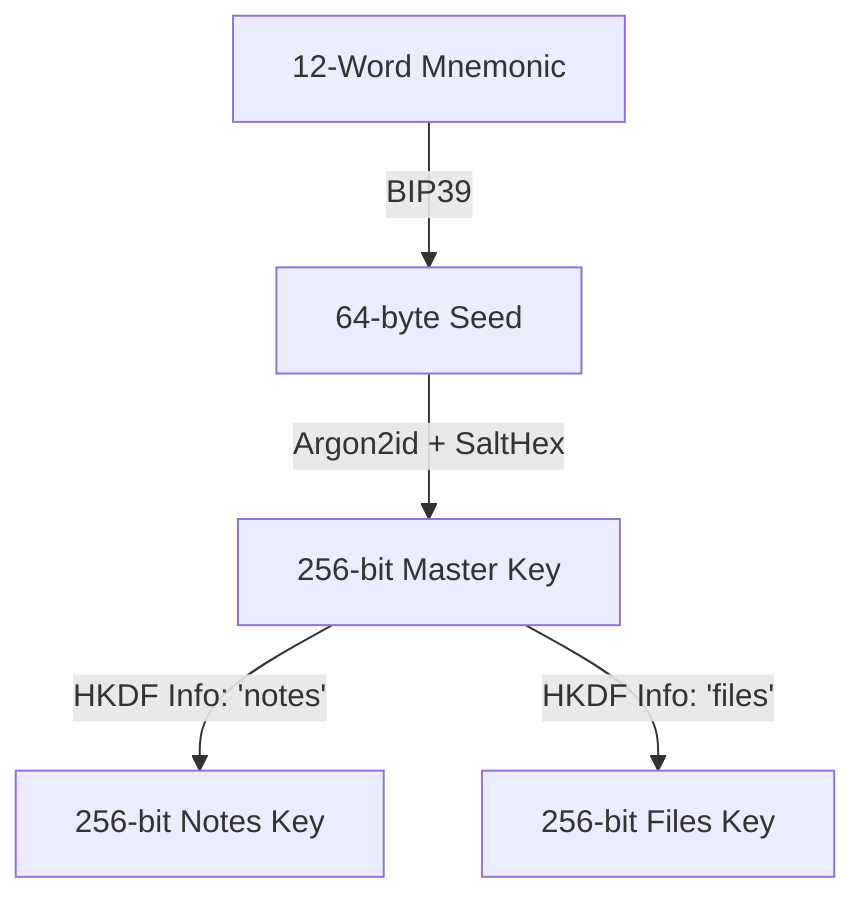
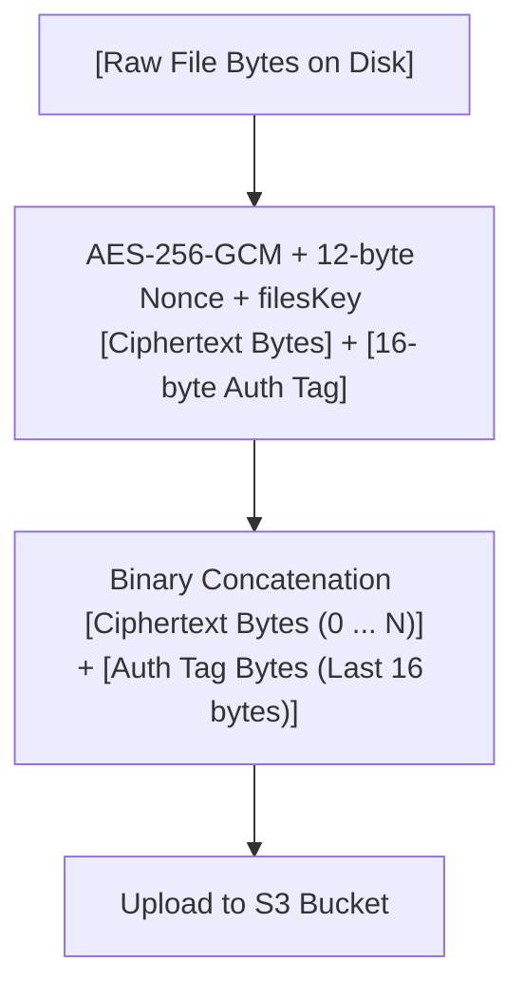

## Architecture Walkthrough: Annota Encryption

> This note is a walkthrough of how the end-to-end encryption (E2EE) and crypto system works in Annota, tracing the flow from a plain-text note (HTML) or raw file on disk to the final encrypted payload sent to the cloud.
> 
> *   <span style="color: #757575">I added links to point to specific functions in the github repository which are mainly in</span> [<span style="color: #757575">crypto.ts</span>](https://github.com/iLiranS/Annota/blob/28b8d74107c51833e00b0f6c831021ccb3eaab15/core/src/utils/crypto.ts) <span style="color: #757575">for</span> <span style="color: #757575">convenience.</span>
>     

### Step 1: Key Generation and Storage

1.  **Master Seed Mnemonic**: When a user signs up or sets up encryption, a 12-word BIP39 mnemonic phrase is generated via [**generateMasterKey**](https://github.com/iLiranS/Annota/blob/28b8d74107c51833e00b0f6c831021ccb3eaab15/core/src/utils/crypto.ts#L24) using a secure random number generator (`customRng`).
    
2.  **Device Keychain Storage**: The mnemonic phrase is encrypted at rest using [**encryptAtRest**](https://github.com/iLiranS/Annota/blob/28b8d74107c51833e00b0f6c831021ccb3eaab15/core/src/utils/crypto.ts#L102) (which uses a device-specific derived key with AES-256-GCM) and securely saved in the device's secure store (keychain) via platform adapters.
    

* * *

### Step 2: Key Derivation (BIP39 + Argon2id + HKDF)

To encrypt or decrypt data, the system needs cryptographic keys derived from the user's mnemonic. This process runs in [**deriveKeysFromMnemonic**](https://github.com/iLiranS/Annota/blob/28b8d74107c51833e00b0f6c831021ccb3eaab15/core/src/utils/crypto.ts#L162):



1.  **BIP39 Seed**: The 12-word mnemonic is converted to a 64-byte binary seed via `mnemonicToSeedSync`.
    
2.  **Argon2id (Memory Hard Key Derivation)**: The 64-byte seed is stretched using **Argon2id** (via [**deriveKeyFromMnemonic**](https://github.com/iLiranS/Annota/blob/28b8d74107c51833e00b0f6c831021ccb3eaab15/core/src/utils/crypto.ts#L162)) with a device-specific `salt` (decoded from the user's `saltHex` string).
    
    *   **Argon2 Settings**:
        
        *   `memory`: 65,536 KiB (64 MB)
            
        *   `passes`: 2
            
        *   `parallelism`: 1
            
        *   `tagLength`: 32 bytes (256-bit key) This yields a **256-bit symmetric Master Key**.
            
3.  **HKDF Subkey Extraction**: To ensure key isolation <span style="color: #757575">(so a compromised notes key cannot access files, and vice versa)</span>, the 256-bit Master Key is passed to **HKDF-SHA256** (via [**deriveSubkeys**](https://github.com/iLiranS/Annota/blob/28b8d74107c51833e00b0f6c831021ccb3eaab15/core/src/utils/crypto.ts#L177)) to extract two distinct subkeys:
    
    *   `notesKey`: Used for note titles, folder structure, metadata, and HTML contents.
        
        *   Derived using `info` parameter = `"notes"`
            
    *   `filesKey`: Used for encrypting raw file attachments (images, PDFs, etc.).
        
        *   Derived using `info` parameter = `"files"`
            

* * *

### Step 3: Note Encryption <span style="color: #757575">(Plain HTML to Encrypted JSON Payload)</span>

During synchronization in [**sync-service.ts**](https://github.com/iLiranS/Annota/blob/28b8d74107c51833e00b0f6c831021ccb3eaab15/core/src/services/files/file-sync.service.ts), notes are encrypted using the derived `notesKey` before being pushed to the cloud:

```plaintext
[Plain HTML Content] + [Metadata]
           │
           ▼ (Object Assembly)
 { id, title, content, ... }
           │
           ▼ (JSON Serialization)
     "JSON String"
           │
           ▼ (UTF-8 Encoding)
    [Plaintext Bytes]
           │
           ▼ (AES-256-GCM + 12-byte Nonce + notesKey)
  [Ciphertext Bytes] + [16-byte Auth Tag]
           │
           ▼ (Base64 Encoding & Concatenation)
"Base64 Ciphertext" + "Base64 Auth Tag" (Last 24 Chars)
```

1.  **Serialization**: The HTML content is combined with its metadata (such as ID, title, folder ID) into a single JavaScript object:
    

```typescript
const dataToEncrypt = { ...metadata, content }; // content contains the HTML
const jsonPayload = JSON.stringify(dataToEncrypt);
```

2.  **UTF-8 Conversion**: The JSON string is encoded into bytes (`Uint8Array`) using UTF-8 formatting.
    
3.  **Initialization Vector (Nonce)**: A cryptographically secure random 12-byte **Nonce** is generated. A unique nonce is critical for AES-GCM to prevent replay attacks and pattern leakage.
    
4.  **AES-256-GCM Encryption**: The plaintext bytes are encrypted using **AES-256-GCM** with the `notesKey` and the generated nonce. This generates:
    
    *   `ciphertext`: The encrypted bytes.
        
    *   `authTag`: A 16-byte authentication tag ensuring the integrity and authenticity of the encrypted data.
        
5.  **Payload Formatting**: In **encryptPayload**:
    
    *   The `ciphertext` is encoded to Base64.
        
    *   The `authTag` is encoded to Base64 <span style="color: #757575">(always exactly 24 characters)</span>.
        
    *   They are concatenated together: `encryptedData = base64(ciphertext) + base64(authTag)`.
        
    *   The nonce is encoded as a Hex string (`nonceHex`).
        
6.  **Upload**: The final packet containing `{ id, encrypted_data: encryptedData, nonce: nonceHex }` is uploaded to Supabase/PostgreSQL database. The server has no access to the keys and only sees scrambled Base64 string data.
    

* * *

### Step 4: File Encryption (Raw Bytes to Encrypted Binary)

For media attachments like images or PDFs, the encryption process (in [**file-sync.service.ts**](https://github.com/iLiranS/Annota/blob/28b8d74107c51833e00b0f6c831021ccb3eaab15/core/src/services/files/file-sync.service.ts)) is slightly different

*   Since files can be large, we avoid Base64 encoding which inflates data size by roughly 33%. While this is trivial for a small JSON note, Base64-encoding of large files like images or PDF files can cause bigger memory overhead.
    



1.  **Read Disk**: The file is read directly from the local device filesystem as a raw byte array (`Uint8Array`).
    
2.  **AES-256-GCM Encryption**: In [**encryptFileBytes**](https://github.com/iLiranS/Annota/blob/28b8d74107c51833e00b0f6c831021ccb3eaab15/core/src/utils/crypto.ts#L283):
    
    *   A 12-byte secure random nonce is generated.
        
    *   The file bytes are encrypted using **AES-256-GCM** with the `filesKey` and the nonce, returning the `ciphertext` and the 16-byte `authTag`.
        
3.  **Binary Concatenation**: The system creates a single new binary payload by placing the `authTag` directly at the end of the `ciphertext`:
    

```typescript
const encryptedFinal = new Uint8Array(ciphertext.length + authTag.length);
encryptedFinal.set(ciphertext, 0);
encryptedFinal.set(authTag, ciphertext.length); // last 16 bytes
```

4.  **Upload**: The concatenated raw binary buffer is uploaded to the Supabase storage bucket (`e2e_attachments`). The `nonceHex` and other metadata (like size and mimeType) are stored separately in the database.
    

* * *

### Decryption flow (Reverse Process)

*   **Notes**: The app slices the last 24 characters from the base64 string to extract the `authTagB64`, decodes it and the ciphertext, decrypts with the `notesKey` and the `nonceHex`, decodes the UTF-8 bytes to JSON, and parses it to retrieve the HTML content.
    
*   **Files**: The app downloads the raw binary, extracts the last 16 bytes as the binary `authTag`, decrypts using the `filesKey` and the `nonceHex`, and writes the decrypted raw bytes to the local filesystem.