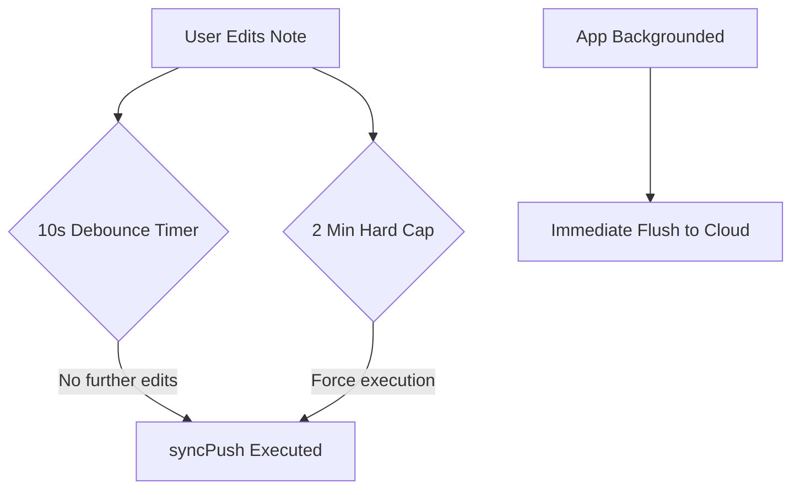
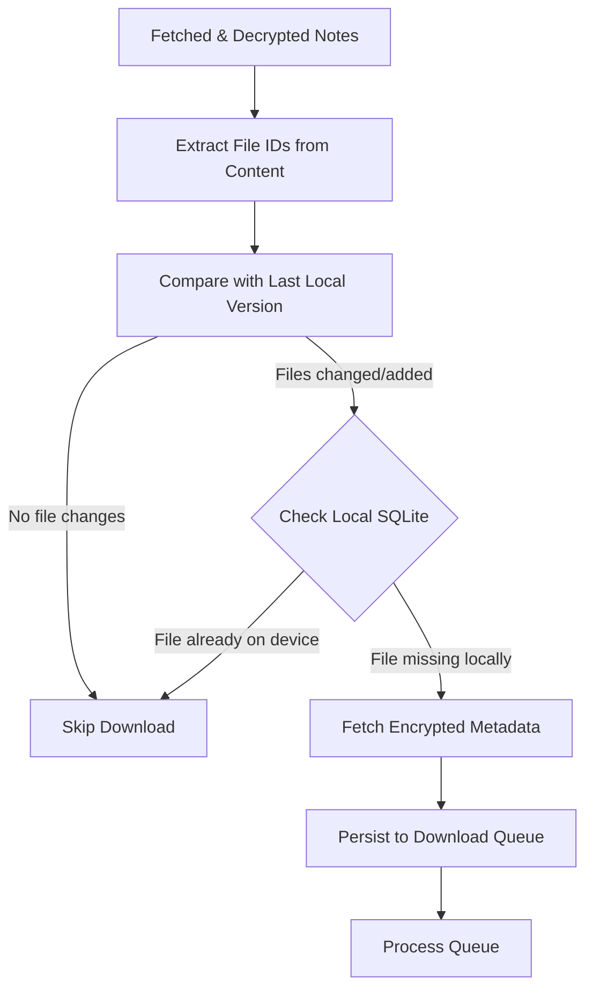

## Architecture Walkthrough: Annota Synchronization

> This note is a walkthrough of the synchronization architecture in Annota, detailing how data flows between the local-first SQLite database and the cloud while maintaining strict end-to-end encryption.  
> If you haven't read about how we lock down the data first, check out the [Architecture Walkthrough: Annota Encryption](https://annota.online/notes/0e0a1841-bc4d-4d44-82a9-9b5db25b7883) note. This covers the core logic found in our [Sync Scheduler](https://github.com/iLiranS/Annota/blob/1817047c6827e822ef896a5e2e815f4835d7e772/core/src/sync/sync-scheduler.ts), [Sync Service](https://github.com/iLiranS/Annota/blob/1817047c6827e822ef896a5e2e815f4835d7e772/core/src/sync/sync-scheduler.ts), and [File Sync Service](https://github.com/iLiranS/Annota/blob/1817047c6827e822ef896a5e2e815f4835d7e772/core/src/sync/sync-scheduler.ts).

### Step 1: The Sync Scheduler (Timing is Everything)

In a local-first application, the user reads and writes to a local database instantly. The cloud is just a secondary mirror. To prevent draining the user's battery or spamming the server with API calls on every keystroke, Annota uses a highly optimized [SyncScheduler](https://github.com/iLiranS/Annota/blob/1817047c6827e822ef896a5e2e815f4835d7e772/core/src/sync/sync-scheduler.ts#L15).

1.  **Debouncing**: Every time a note's content changes, a 10-second debounce timer resets. We wait for the user to pause typing before initiating a background push.
    
2.  **The Hard Cap**: To ensure data isn't trapped locally during a very long, uninterrupted typing session, a hard maximum timer forces a sync every 2 minutes of continuous editing.
    
3.  **App State Awareness**: If the user sends the app to the background, the scheduler immediately flushes any pending changes to the cloud. Conversely, if the app is brought to the foreground and it has been more than 5 minutes since the last sync, a fresh pull is triggered automatically.
    
    *   This is especially useful for mobile apps - where users can leave the app in the background for long periods.
        

### Step 2: The Push Flow (Local -> Cloud)

When the scheduler determines it's time to upload, `performSyncPush` takes over.

1.  **Gathering Dirty Records**: The local database tracks modified items (Folders, Tags, Notes) via a dirty flag.
    
2.  **Batching**: To keep payloads manageable, records are chunked into batches of 50.
    
3.  **Encryption & Payload Assembly**: Each item in the batch is serialized, merged with its content, and encrypted using the derived `notesKey` (as covered in the Encryption walkthrough).
    
4.  **Tombstones (Soft Deletions)**: If a user deletes a note locally, it is marked as a "tombstone" (`isPermDeleted: true`). We upload this tombstone state to the cloud so other devices know to delete it. Only _after_ the cloud confirms the update do we permanently delete the record and its foreign-key children from the local SQLite database. (foreign key children are note versions and files links associated with those versions)
    
5.  **Tracking Files (Push-Only)**: Each note's metadata contains a list of associated file IDs. When pushed, if the update includes file changes, we replace the `note_files` bridge table rows for that note with the updated file list. Note that this table is *write-only* for the client; it is never queried during the pull flow.
    
> **Backend Garbage Collection**: Because the note contents are end-to-end encrypted, the backend cannot scan the notes to determine which files are still active. The `note_files` table acts as the backend's source of truth for file references. When a file is unreferenced across all notes (e.g. after a note update or deletion), a backend garbage collection process safely purges the orphaned `encrypted_files` metadata records and their corresponding storage bucket objects.
        

### Step 3: The Pull Flow (Cloud -> Local)

Pulling data down via `performSyncPull` relies on **Cursor-Based Pagination** to ensure we only download what has changed since the last sync.

1.  **Cursors**: The app maintains a pointer (`updated_at` time and `id`) for Notes, Folders, and Tags.
    
2.  **Foreign Key Management**: Before processing incoming data, the local SQLite database temporarily disables foreign keys (`PRAGMA foreign_keys = OFF;`). This allows us to cleanly handle complex relational deletions (like a folder and its child notes) without triggering constraint errors.
    
3.  **Batch Decryption**: Incoming cloud items are pulled in batches of 15. They are decrypted in memory, parsed, and then safely upserted into the local database inside an atomic transaction.
    

### Step 4: File Syncing (The Heavy Lifting)

Files (images, PDFs) require a completely distinct flow because of their size and their many-to-many relationship with notes. This is managed by the `FileSyncService`.

1.  **Intelligent Local Diffing**: When new notes are pulled and decrypted, we extract the file IDs directly from the note content (e.g. image tags). Rather than making a remote network call to query a bridge table like `note_files` during pull, the sync service compares these extracted IDs against the file IDs of the note's previous local version. We only download files that are actually new to this device, skipping any extra API calls for notes with unchanged files.
    
2.  **Cryptographic Nonce Retrieval**: For the files that _are_ missing locally, the app queries the `encrypted_files` table to retrieve their metadata and, most importantly, the cryptographic `nonce` required to decrypt them.
    
3.  **Concurrency Control**: The download queue processes a maximum of 3 file downloads concurrently (`MAX_CONCURRENT_DOWNLOADS = 3`) to reduce amount of network errors along the way.
    
4.  **Safety Nets**: Before starting the download, the intent to download is persisted to the local database. If the app closes mid-download, the queue is preserved and resumes on the next launch. Once the raw encrypted bytes are downloaded from the storage bucket, they are decrypted using the `filesKey` and the fetched `nonce`, and finally written to the local filesystem.
    

### Extra : Local File System

Locally, we might have more files than the database - this scenario can happen if we delete a file from a note and this file is not represented in any note latest version.

In this case, the file won’t be deleted due to “local version history” system we have - so the user can still use the file.

So unlike the database which associate files with latest version of the note, locally a file is associated with a version of a note and not the note itself - once there is no version of any note that uses the file, the file will automatically be deleted from the system.