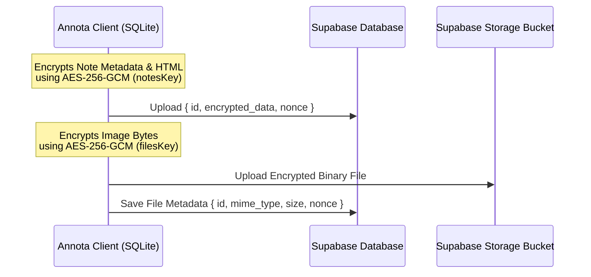

[Annota](https://annota.online) is a fully **local-first, offline-capable, end-to-end encrypted note-taking application** designed with a security-first architecture. It features dedicated desktop applications built with **Tauri** (macOS, Windows) and mobile apps built with **React Native + Expo** (iOS, Android coming soon). 

With Annota, all your notes and attachments are encrypted client-side. The sync backend acts as a blind data-store, storing only scrambled blobs and nonces—meaning only you can access your data.

Check out the [Annota GitHub Repository](https://github.com/iLiranS/Annota) to explore the codebase.

---

## 🚀 Key Features

### 📝 The Rich-Text Editor
- **Advanced Features**: Powered by TipTap (embedded natively on mobile and desktop), supporting code syntax highlighting, LaTeX equations (with preview modals), Mermaid diagrams, and tables.
- **Interactive Flashcards**: Create and study custom flashcards directly inside your notes.
- **Slash Commands & Hashtags**: Quickly trigger formatting options, media insertion, and tagging with `#` tags or `/` commands.
- **Markdown Import/Export**: Import notes from markdown, or export them to markdown, PDF, or HTML.

### 🌳 Workspace & Customization
- **Infinite Folder Nesting**: Organize your ideas into infinitely nested tree-like folder structures.
- **Visual Personalization**: Choose custom accent colors and select from over 1,000 icons for folder customization.
- **Daily Notes Calendar**: A dedicated calendar view for daily logs (exclusive to the desktop application; mobile displays a streamlined list).
- **Quick Access**: Pin frequently used notes for rapid lookup.
- **Soft Deletion**: Securely trash notes and folders with a safe restoration system to prevent accidental loss.

### ⚙️ Deep Settings Customization
- **Editor Settings**: Configure styling down to the font family, font size, line spacing, margins, and compact mode.
- **Multi-window Support (Tauri Desktop)**: Open multiple notes simultaneously in native desktop windows, backed by secure, high-performance Inter-Process Communication (IPC) and lightweight window previews.

### 🧠 Token-Friendly Smart AI
- **Ollama & BYOK**: Connect a local Ollama model for 100% private offline AI assistance, or bring your own API key (BYOK) for cloud models. Keys are stored encrypted locally.
- **Vector-Free RAG**: A customized Retrieval-Augmented Generation system using SQLite's `FTS5` extension and a custom scoring algorithm instead of a resource-heavy vector database.
- **Context Optimization**: Select up to 100 notes as chat context. The engine automatically splits long documents into chunks and summarizes their structural layout skeletons, passing only the most crucial context blocks to remain highly token-friendly.

---

## 🔒 Security & E2EE Architecture

Annota protects user data at rest and in transit through a robust cryptographic design:

### 1. Key Derivation & Isolation
Every user workspace derives keys starting from a 12-word BIP39 mnemonic seed:
- The mnemonic is stored encrypted at rest using platform secure keychains.
- Upon unlock, the mnemonic is stretched to a **256-bit symmetric Master Key** via **Argon2id** (64MB memory, 2 passes, 1 thread).
- **HKDF-SHA256** is then used to derive isolated subkeys:
  - `notesKey`: Encrypts note titles, folders, metadata, and HTML contents.
  - `filesKey`: Encrypts raw binary attachments (images, PDFs, etc.).

For a step-by-step cryptographic walkthrough, see:
👉 [Architecture Walkthrough: Annota Encryption](/blog/annota-encryption)

### 2. Encryption at Rest (Local-First)
Even when fully offline, your workspace database is encrypted at rest using **SQLCipher**, protecting your notes against physical device theft or direct database inspection.

### 3. File Insertion & Compression
- **Smart Reference Reuse**: Files are hashed on insertion. If you attach an image or PDF that already exists in your workspace, Annota reuses the reference rather than uploading it multiple times.
- **Local Compression**: Images are compressed locally before encryption, dramatically reducing sync overhead without compromising visual usability.
- **Direct Binary GCM**: Attachment binaries are encrypted with **AES-256-GCM**. To save 33% overhead, the client bypasses Base64 encoding and appends the 16-byte authentication tag directly onto the end of the ciphertext bytes.

---

## 🔄 Cloud Sync & Backend Infrastructure

Annota's optional cloud sync system operates deterministically on **Supabase** (Postgres + S3 Buckets). The server is completely blind to raw plaintext data.

### Backend Database Logic & Constraints
- **Row-Level Security (RLS)**: Enforces strict tenant isolation. Users can only read, write, or query their own rows.
- **Profile Protection Triggers**: Database triggers prevent clients from changing sensitive fields like `role` or `storage_used_bytes` directly, requiring validation via Supabase edge functions.
- **Tier-based Limits**: An database trigger function enforces limits before inserts occur:
  - **Free Tier**: Limited to 100 notes, 20 folders, and 20 tags.
  - **Pro/Beta Tiers**: Allowed up to 7,500 notes, 1,000 folders, and 1,000 tags.
- **Tombstones & Garbage Collection**: Soft-deleted notes/folders are cleaned up automatically via Postgres scheduled cron tasks. Encrypted data is stripped (shredded to empty strings) after 7 days, and tombstones are fully purged after 3 months.
- **Orphaned File Cleaner**: Periodically identifies and sweeps files in S3 storage that no longer have mapping references inside the `note_files` table.

### 🌐 Public Web Publishing
Premium users can securely publish selected documents to the public web ([annota.online](https://annota.online)):
- When publishing, the client exports a markdown version of the note to a dedicated, public `published_notes` table in Postgres (bypassing the E2EE sync table).
- A Next.js web application renders this using **Incremental Static Regeneration (ISR)**.
- Database webhooks watch the `published_notes` table and instantly fire cache eviction requests (`revalidatePath` / `/api/revalidate-note`) when notes are edited or unpublished.

For a detailed look at the web publishing pipeline, read:
👉 [Architecture Walkthrough: Annota Public Notes](/blog/annota-published-notes)

---

## 📱 Platforms & Download
- **Desktop**: Tauri application targeting macOS and Windows.
- **Mobile**: React Native + Expo app targeting iOS  and Android.
- **Web**: Account portal and public document hub at [annota.online](https://annota.online).
