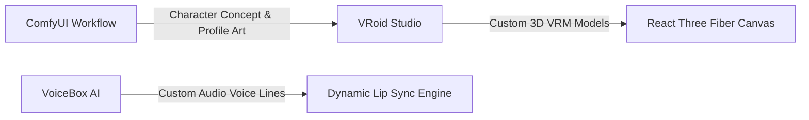
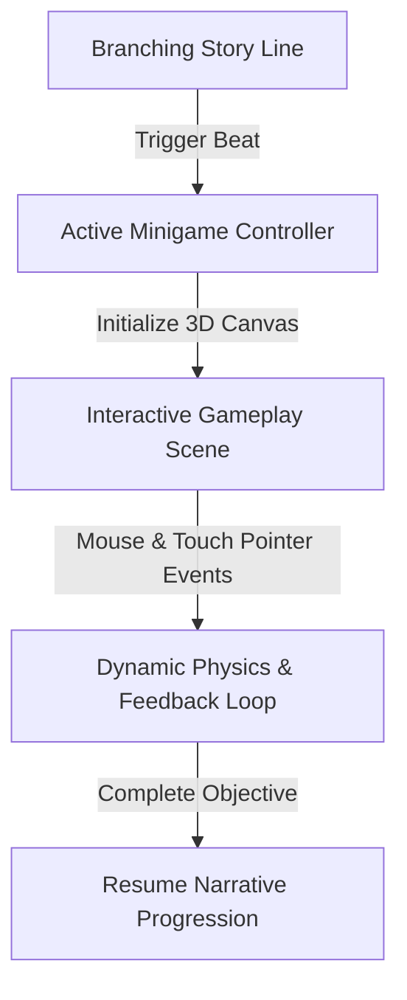

> **The Game & Engine is still a Work in Progress...**

A desktop-class visual novel engine built entirely on web technologies. By combining **React**, **Tauri**, and **Three.js** (via React Three Fiber), the engine achieves console-grade 3D character rendering, procedural animations, and interactive mini-games—all running within a lightweight desktop container that bypasses the resource-heavy footprint of traditional Electron apps.

---

## 🛠️ The Tech Stack: Pushing Web Tech to the Limit

Developing a modern 3D experience in the browser requires a carefully tuned balance between aesthetic fidelity and runtime performance.

*   **Tauri (Rust Core)**: Used as the desktop application wrapper, keeping the memory footprint as low as possible and providing native OS bridges.
*   **React + Zustand**: Drives the visual novel's state machine, dialogue system, branching story choices, and state-driven beats.
*   **React Three Fiber & Pixiv VRM**: Handles real-time rendering of complex anime-style characters with bone-based rigging, shaders, and light sources.
*   **ComfyUI & VRoid Studio**: Serves as the content creation pipeline, generating 2D visual reference boards and translating them into fully rigged 3D avatar characters.
*   **VoiceBox AI**: Powers the audio generation pipeline, producing custom voiceovers mapped directly to real-time lip-sync.

---

## 🎭 Intelligent VRM Avatar System

Instead of using static 2D sprites or pre-rendered videos, characters are loaded as fully interactive **VRM 3D models** in real time. 

### 1. Procedural Lifelike Animations
To prevent characters from looking stiff, the engine runs continuous procedural animation loops on the model's skeletal joints:
*   **Micro-Saccades & Wander**: Simulated eye movements that realistically jitter and wander slightly to emulate human focus.
*   **Natural Breathing Cycles**: Sine-wave animations that affect the spine, chest, and head at randomized frequencies.
*   **Idle Posture Shifting**: Weight shifts between the left and right legs over time, preventing the "statue" effect.
*   **Dynamic Head Tracking**: Characters orient their heads and eyes naturally toward the screen or the current speaker.

### 2. Real-Time Amplitude Lip-Sync
The engine integrates audio-level analysis to drive the mouth blendshapes (`A`, `I`, `U`, `E`, `O`) in real-time. If voice files are playing or dialogue is typing, the avatar's jaw and mouth scale and flex programmatically in sync with the sound waves.

### 3. Smart Expression Blending
Transitions between expressions (e.g., *happy*, *confused*, *serious*) use weight-interpolation curves, allowing expressions to blend smoothly rather than snapping instantly.

---

## 🎨 Asset Creation & AI Pipeline

Creating custom assets for a 3D visual novel is accelerated through a modern, hybrid pipeline of generative AI and 3D modeling tools:

*   **Concept Art & Style Reference (ComfyUI)**: A custom Stable Diffusion workflow in ComfyUI generates unified character profile pictures and art styles. These serve as the blueprint and stylistic reference board for 3D modeling.
*   **3D Character Modeling (VRoid Studio)**: High-quality, custom anime-style characters are modeled in VRoid Studio based on the ComfyUI designs, then optimized and exported directly as `.vrm` files.
*   **Custom Voice Generation (VoiceBox)**: Voice lines are generated using VoiceBox, enabling custom, unique voice profiles for each character. These audio assets feed directly into the engine's dynamic lip-sync script.

---

## ⚙️ Performance Optimizations

Running multiple rich 3D models alongside interactive scenes demands strict resource management:

*   **Loader Cache Purging**: The engine clears `THREE.Cache` on scene transitions, forcing garbage collection of heavy GLTF textures and buffers to prevent memory leaks during long play sessions.
*   **Adaptive Canvas Resolution**: Pixel ratio limits and antialiasing options scale dynamically based on the user's selected performance profile (DPR ranges from `1.0` to `1.5`).
*   **Dialogue Box Clipping Masks**: To ensure UI controls are cleanly visible, a custom clipping mask cuts off 3D character rendering exactly where the dialog box overlays, preventing avatars from clipping through UI elements.

---

## 🎮 Interactive 3D Gameplay & Minigames

Rather than being a passive reading experience, the story beats seamlessly hand off control to interactive 3D gameplay and minigames running on the same Canvas:

When a gameplay beat is triggered, the visual novel UI transitions smoothly, and the active minigame takes over the viewport. Players interact directly with 3D elements on the Canvas using physics, pointer events, and custom materials to solve puzzles or complete action sequences before resuming the story narrative.

---

## 🔮 Next Steps

*   **Implementing the Actual Plot**: Scripting and choreographing the core storyline narrative, choice paths, and character dialog beats.
*   **Advanced Post-Processing & Assets**: Integrating high-fidelity visual effects using post-processing stacks (like Bloom and Ambient Occlusion) and custom 3D environmental assets.
*   **Cool Interactive Systems**: Building richer player mechanics, immersive inspection interactions, and dynamic environments.